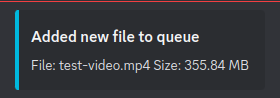

# Transcoding Handler 264 -> X

## Getting Started
- [Install Docker](https://docs.docker.com)
- [Install Docker Compose](https://docs.docker.com/compose/install/)

Create `.env` by copying the template and enter necessary variable values (see #Environment Variables).
```bash
cp .env_template .env
```

## Project Structure

    .
    ├── scripts              # Container scripts 
    │   ├── init.sh             # Shell script to identify h264 files
    ├── src                  # Source code folder 
    │   ├── download.py         # Download script -> runs per crontab
    │   ├── upload.py           # Upload script -> runs per crontab
    │   └── utils.py            # Helper functions
    ├── .env_template
    ├── crontab                 # Defines how often upload/download should run
    ├── Dockerfile            
    ├── docker-compose.yml
    └── README.md

## Starting handler

### Running with docker-compose

``` bash
docker-compose up -d
```

### Running with docker-cli

1. Build container image

``` bash
docker build -t transcoding-handler:latest .
```

2. Run container image

``` bash
docker run -d \
  --name transcoding-handler \
  --env-file .env \
  -v <files>:/app/files \
  -v <tmp>:/tmp_folder \
  transcoding-handler:latest
```

### Useful commands

To check logs of container, run the following command

``` bash
docker logs transcoding-handler -f
```

To see a full list of all files in queue, run

``` bash
docker exec -it transcoding-handler cat /app/files_big.json
```

## Environment Variables

```bash

    # SSH Credentials 
    SERVER_URL=
    SSH_USERNAME=
    SSH_PASSWORD=

    # Defines how many files should be uploaded at once
    # Can be useful if more than one worker is configured
    UPLOAD_COUNT=2

    # Set the filesize to filter - Default 7GB
    FILE_THRESHOLD=7000000000

    # Set remote path where files should be uploaded and downloaded
    # e.g /media/input and /media/output
    UPLOAD_DIR=
    DOWNLOAD_SOURCE=

    # Defines your Discord Webhook URL to send notification
    # e.g. 
    DISCORD_TOKEN=
```

## Discord notifications

When upload was successful, the handler will send a notification with the discord webhook.



When transcoding has been finished and downloader has grabbed the transcoded file, it will send a notification with some results.


